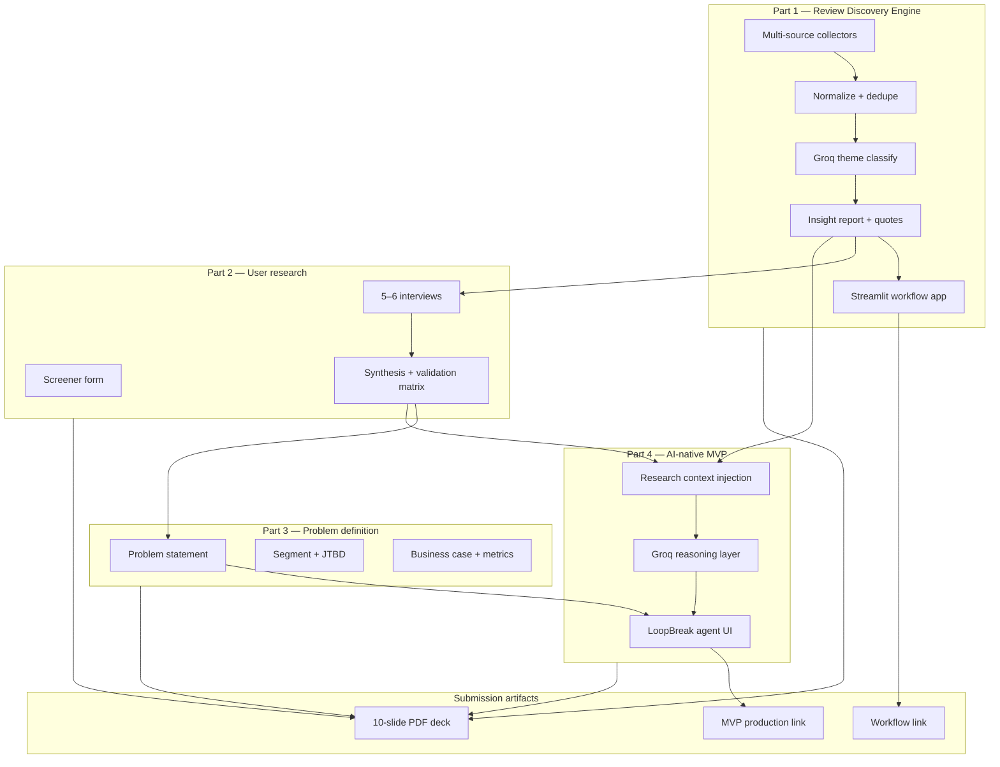
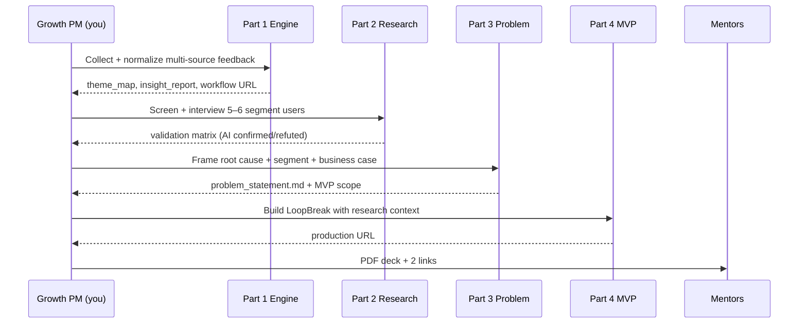
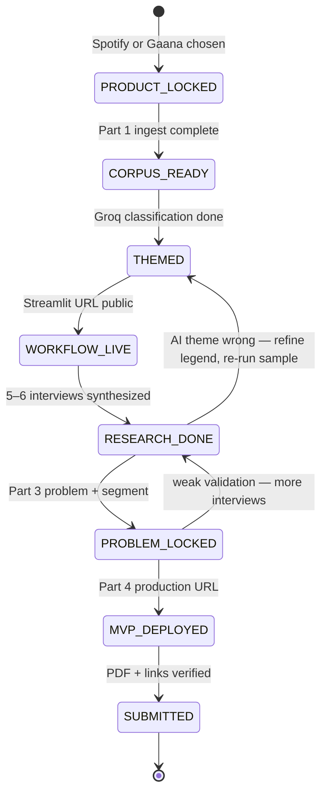
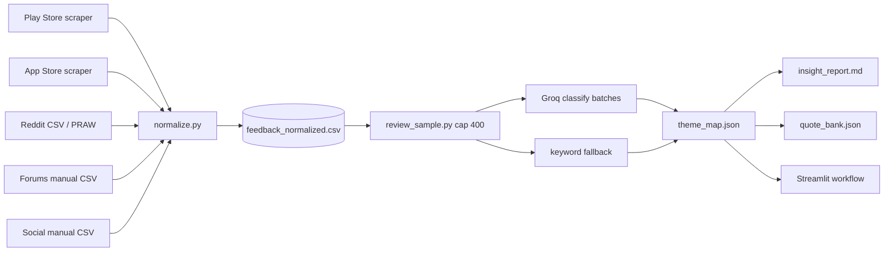
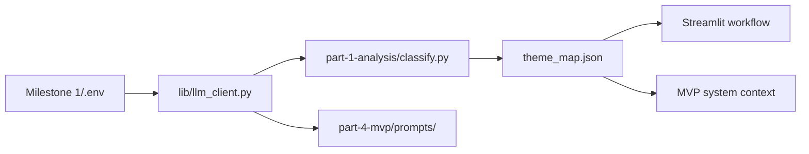
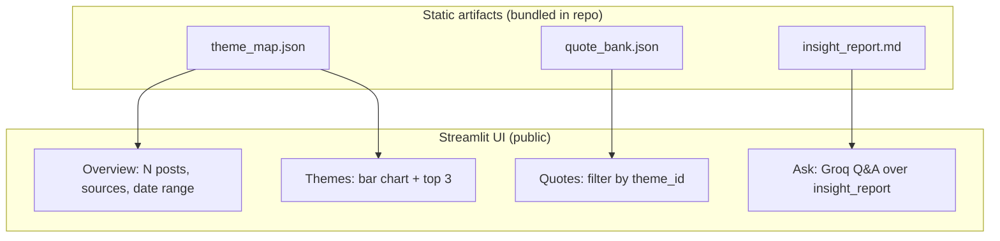
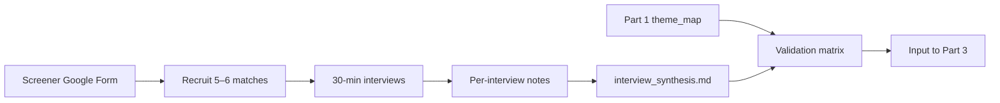
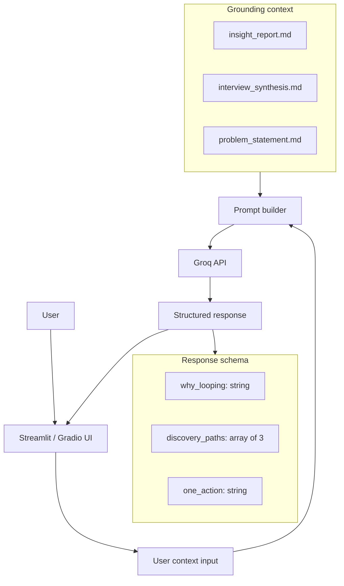
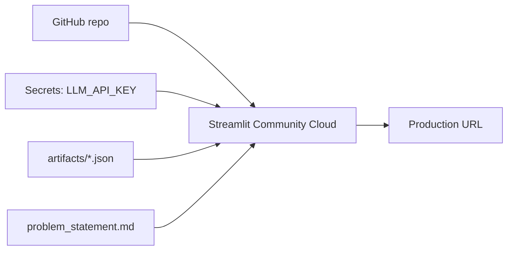
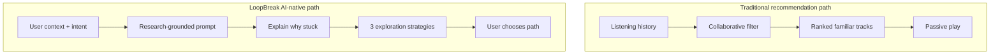

# Architecture — Music Discovery Graduation Project

Single architecture reference for the NextLeap graduation submission: **AI-powered review discovery**, **primary research validation**, **problem definition**, and **AI-native MVP** for a Growth PM challenge at **Spotify** or **Gaana**.

**Strategic goal:** Increase meaningful music discovery and reduce repetitive listening (comfort playlists, familiar artists, previously discovered tracks).

Build steps and weekly calendar: [ROADMAP.md](./ROADMAP.md).  
Submission deadline: **6 July 2026, 3:59 PM IST**.

This design follows a **research-before-solution** pipeline—Part 1 AI insights are hypotheses until Part 2 interviews validate them; Part 4 MVP solves **one** narrowed problem from Part 3, not the entire discovery space.

---

## Related documents

| Document | Purpose |
|----------|---------|
| [ROADMAP.md](./ROADMAP.md) | Part-by-part execution, free tools, deck outline, submission checklist |
| [README.md](./README.md) | Entry point, folder structure, deliverable index |
| [problem.md](./problem.md) | Official problem statement (Parts 1–4 + deliverables) |
| [implementation.md](./implementation.md) | Hands-on build guide *(planned)* |
| [edge-cases.md](./edge-cases.md) | Part-wise edge cases, QA matrix, smoke scenarios |
| [decisions/](./decisions/README.md) | ADR index — product & tech choices *(planned)* |
| [../Milestone-2-Review/architecture.md](../Milestone-2-Review/architecture.md) | Reusable ingest / Groq / theme patterns |

---

## 1. Product and business scope

| Field | Value |
|-------|--------|
| **Company role** | Product Manager, **Growth Team** |
| **Product (choose one)** | **Spotify** *(recommended)* or **Gaana** |
| **Company context** | Millions of users; world-class recommendation system |
| **Observed behavior** | Significant listening from repeat playlists, familiar artists, old discoveries |
| **Strategic goal** | Increase **meaningful discovery**; reduce **repetitive listening** |
| **Your constraint** | Must analyze feedback **before** proposing solutions (Part 1) |
| **Research constraint** | AI insights **must** be validated with **5–6 interviews** (Part 2) |
| **MVP constraint** | Deployed to **production** (public URL); must show **why AI** beats traditional reco |

### 1.1 What makes this submission stand out

| Differentiator | Architectural mechanism |
|----------------|-------------------------|
| **Evidence-first PM** | Part 1 corpus → Part 2 validation matrix → Part 3 single problem |
| **Multi-source signal** | App Store + Play + Reddit + forums + social in one normalized schema |
| **Grounded AI** | Themes and quotes trace to `feedback_id`; MVP prompts inject `insight_report` |
| **Not a ChatGPT summary** | Repeatable Python pipeline + public Streamlit workflow URL |
| **AI-native MVP** | LLM explains *why* user loops + offers paths—not just next-track prediction |
| **Business metrics** | KPI tree ties MVP to discovery session rate, new artist listens, retention |

### 1.2 Traceability to problem statement parts

| Official part | System component | Primary output |
|---------------|------------------|----------------|
| **Part 1** | Review Discovery Engine | `theme_map.json`, workflow URL, `insight_report.md` |
| **Part 2** | Research validation layer | `interview_synthesis.md`, validation matrix |
| **Part 3** | Problem definition | `problem_statement.md`, segment + JTBD |
| **Part 4** | LoopBreak MVP (AI agent) | Production URL, grounded prompts |
| **Deck** | Narrative packaging | `NL Spotify.pdf` (10 slides, no fellow name) |

---

## 2. System boundaries



| Layer | Responsibility | Technology |
|-------|----------------|------------|
| **Collection** | Pull public feedback from stores, Reddit, forums, social | Python scrapers, manual CSV, PRAW |
| **Intelligence (Part 1)** | Classify ≤8 discovery themes; cross-source aggregation | Groq LLM + keyword fallback |
| **Research (Part 2)** | Validate / refine AI themes with primary interviews | Google Form, Meet, synthesis doc |
| **Product logic (Part 3)** | Narrow to one problem + segment + business metrics | Markdown artifacts |
| **MVP (Part 4)** | Explain loop + 3 discovery paths with research grounding | Streamlit/Gradio + Groq |
| **Delivery** | Public URLs + PDF deck | Streamlit Cloud / HF Spaces, Google Slides |

**Hard rules**

- Part 1 completes **before** MVP scope is locked in Part 3.
- MVP prompts **must** cite Part 1 themes / Part 2 quotes—not generic music advice.
- No paid social-listening APIs required; public data only.
- No Spotify Web API required for graduation MVP (catalog integration = v2).

---

## 3. End-to-end runtime flow



### 3.1 Project state machine



**Invariant:** `PROBLEM_LOCKED` requires ≥3 Part 1 themes validated (Y or Partial) in `interview_synthesis.md`.

---

## 4. Part 1 — AI-Powered Review Discovery Engine

Corresponds to **Part 1** of the official brief. Answers six research questions from public feedback at scale.

### 4.1 Research questions → theme mapping

| Question | `theme_id` tags |
|----------|-----------------|
| Why struggle to discover new music? | `discovery_friction` |
| Frustrations with recommendations? | `bad_recommendations` |
| Listening behaviors users want? | `mood_listening`, `social_discovery` |
| Why repeat same content? | `repeat_listening`, `library_clutter` |
| Segment differences? | `platform`, `rating`, `source`, optional `segment_hint` |
| Unmet needs across sources? | Cross-tab in `source_breakdown.json` |

### 4.2 Data sources architecture



| Source | Collector | Target volume | Free tool |
|--------|-----------|-----------------|-----------|
| Google Play | `scrape_play.py` | 500–1,000 | `google-play-scraper` |
| App Store | `scrape_ios.py` | 300–500 | `app-store-scraper` or Kaggle bootstrap |
| Reddit | `scrape_reddit.py` or manual | 30–50 threads | PRAW / manual CSV |
| Forums | `forums_raw.csv` | 20–40 threads | Manual paste |
| Social | `social_raw.csv` | 15–30 posts | Manual Twitter/YouTube |

**Package IDs (lock in `config/product.json`):**

| Product | Android | iOS app id (example) |
|---------|---------|----------------------|
| Spotify | `com.spotify.music` | `324684580` |
| Gaana | `com.gaana.android` | `561712044` |

### 4.3 Canonical data model — `feedback_normalized.csv`

| Column | Type | Required | Notes |
|--------|------|----------|-------|
| `feedback_id` | string | yes | Hash of `source` + `text` |
| `source` | enum | yes | `play_store` \| `app_store` \| `reddit` \| `forum` \| `social` |
| `platform` | enum | yes | `ios` \| `android` \| `web` |
| `date` | date | yes | ISO |
| `rating` | int 1–5 | no | Null for Reddit/forums |
| `text` | string | yes | English-only for MVP pipeline |
| `title` | string | no | Post title or review title |
| `upvotes` | int | no | Engagement proxy |
| `url` | string | no | Traceability for mentors |
| `language` | string | no | `en` after filter |

**Reuse:** Normalization logic from [Milestone-2-Review/phase-1/1.2-ingest/](../Milestone-2-Review/phase-1/1.2-ingest/) (English ratio, emoji drop, dedupe).

### 4.4 Theme legend (max 8)

| theme_id | Label | Includes | Excludes |
|----------|-------|----------|----------|
| `discovery_friction` | Hard to find new music | Can't find genres, search fails | Pure audio quality |
| `bad_recommendations` | Reco products miss | Discover Weekly, Radio, Daily Mix | Pricing only |
| `repeat_listening` | Same content on loop | Repeat playlists, same artists | Intentional favorites |
| `library_clutter` | Library too large to explore | Saved songs, liked songs overload | Upload issues |
| `ui_complexity` | UI blocks exploration | Navigation, clutter | Account login |
| `social_discovery` | Wants shared / friend discovery | Blend, friend activity | Unrelated social features |
| `podcast_vs_music` | Podcasts crowd out music | Home feed mix | Podcast quality |
| `pricing_ads` | Free tier limits exploration | Ads, skips, paywall | Unrelated billing bugs |

One **primary** `theme_id` per row (same pattern as Milestone-2 ADR-003).

### 4.5 LLM configuration (Groq — Part 1 + Part 4)

| Variable | Purpose | Source |
|----------|---------|--------|
| `LLM_MODE` | `api` for Groq | [Milestone 1/.env](../Milestone%201/.env) |
| `LLM_API_KEY` | Groq key | Shared env (not in repo) |
| `LLM_MODEL` | `llama-3.1-8b-instant` | Free tier default |
| `MILESTONE_2_ENV_FILE` | Override env path | Optional |

**Cost control:** [lib/review_sample.py](../Milestone-2-Review/lib/review_sample.py) — stratified sample **300–500** rows to Groq; remainder keyword-classified. Full corpus kept for counts.



### 4.6 Part 1 artifacts

| Artifact | Path | Purpose |
|----------|------|---------|
| Normalized corpus | `data/feedback_normalized.csv` | Single source of truth |
| Theme map | `artifacts/theme_map.json` | Counts, shares, by-source splits |
| Insight report | `artifacts/insight_report.md` | Answers 6 research questions with numbers |
| Quote bank | `artifacts/quote_bank.json` | Verifiable quotes per theme |
| Source breakdown | `artifacts/source_breakdown.json` | Play vs Reddit vs forum |
| Ingest report | `artifacts/ingest_report.json` | Drops, language, dedupe stats |
| **Workflow URL** | Streamlit Cloud | **Deliverable #1** |

### 4.7 Review Analysis Workflow app (deliverable #1)

**Deploy target:** Streamlit Community Cloud (free) or Hugging Face Spaces.



**Deck requirement:** One slide with 3-box diagram + hyperlink to this URL.

---

## 5. Part 2 — Validate Through User Research

Corresponds to **Part 2**. AI-generated insights are **hypotheses** until validated here.

### 5.1 Segment definition (lock before interviews)

Example (Spotify / India):

> Users aged 22–35, 5+ hrs/week listening, ≥60% from saved playlists/liked songs, rarely engage with Discover Weekly.

Stored in: `config/product.json` → `target_segment`.

### 5.2 Research pipeline



| Artifact | Path | Content |
|----------|------|---------|
| Screener | Google Form URL (linked in deck) | Age, hours, % repeat, DW usage |
| Interview guide | `part-2-research/interview_guide.md` | Script + Part 1 theme probes |
| Raw notes | `part-2-research/notes/` | One file per participant (no PII in deck) |
| Synthesis | `part-2-research/interview_synthesis.md` | Behaviors, pains, validation matrix |

### 5.3 Validation matrix (required)

| Part 1 theme | Validated? | Interview evidence |
|--------------|------------|-------------------|
| `repeat_listening` | Y / N / Partial | Quote |
| `bad_recommendations` | Y / N / Partial | Quote |
| … | | |

**Gate:** Part 3 cannot start until ≥3 themes have Y or Partial with cited quotes.

---

## 6. Part 3 — Define the Problem

Corresponds to **Part 3**. Converts research into **one** actionable problem for the MVP.

### 6.1 Problem artifact schema — `part-3-problem/problem_statement.md`

```markdown
## Problem (one sentence)
[Segment] struggles to [behavior] because [root cause].

## Root cause
- Interview evidence: ...
- Corpus evidence: ... (theme %, N quotes)

## Target segment
- Who, size proxy, JTBD

## Business case
- Link to strategic goal (meaningful discovery)
- Metrics: discovery session rate, new artist listen rate, D7 retention
- Why now: repeat listening plateau at scale
```

### 6.2 Problem selection criteria

Pick **one** narrowed problem where:

1. Strongest Part 2 validation  
2. Clearest gap vs traditional collaborative filtering  
3. Clearest AI advantage (intent, context, explainability)  
4. Demo-able in Streamlit without Spotify API  

| Candidate problem | MVP pattern |
|-------------------|-------------|
| Discover Weekly feels irrelevant | Context briefing before DW |
| Post-work comfort playlist loop | Transition-moment coach |
| Saved library too large | Forgotten-gems resurfacing |

**Output:** `part-3-problem/mvp_scope.json` — `{ "problem_id", "segment", "hypothesis", "success_metrics[]" }`

---

## 7. Part 4 — AI-Native MVP (LoopBreak)

Corresponds to **Part 4**. Must be **deployed to production** with a public URL.

### 7.1 Why traditional recommendation is insufficient

| Traditional reco | Limitation for discovery goal |
|------------------|-------------------------------|
| Collaborative filtering | Reinforces familiar taste clusters |
| Playlist continuation | Optimizes session length, not novelty |
| Discover Weekly batch | No user intent or moment context |
| Black-box ranking | User can't learn *why* or *how* to explore |

### 7.2 What AI unlocks

| AI capability | User-facing change |
|---------------|-------------------|
| Natural language intent | User describes moment, not just plays |
| Explainable reasoning | “You're looping because…” grounded in research |
| Strategy not just tracks | 3 **paths** (mood shift, social, library dig) |
| Research-grounded prompts | Themes/quotes from Part 1–2 in system context |

### 7.3 LoopBreak architecture



**User flow**

1. Select persona or describe listening context (free text).  
2. LLM returns: **why looping** (1 sentence) · **3 discovery paths** · **one concrete action**.  
3. Optional: paste Discover Weekly frustration → tailored tips.

**Fallback:** If Groq rate-limits, serve cached exemplar responses from `part-4-mvp/fixtures/sample_responses.json`.

### 7.4 MVP deployment architecture



| Environment | Host | Cost |
|-------------|------|------|
| Production | `*.streamlit.app` or `*.hf.space` | Free |
| Local dev | `streamlit run app.py` | Free |

**Deliverable #3:** Production URL in submission + hyperlinked in deck slide 8.

**Out of scope v1:** Spotify OAuth, playback control, personal listening history import.

---

## 8. Traditional reco vs AI-native MVP (conceptual)



---

## 9. Deliverables architecture

| # | Deliverable | System source | Verification |
|---|-------------|---------------|--------------|
| 1 | Review workflow link | Part 1 Streamlit app | Loads in incognito; shows themes + quotes |
| 2 | 10-slide PDF | `deck/NL Spotify.pdf` | ≤10 slides, no name, font ≥14pt, <40 MB |
| 3 | MVP production link | Part 4 Streamlit/HF | Interactive without localhost |

### 9.1 Deck ↔ system traceability

| Slide (message title) | Backed by |
|-----------------------|-----------|
| Repeat listening is growth's hidden ceiling | Part 1 `repeat_listening` % |
| Analyzed 1,000+ posts across 4 sources | `ingest_report.json` + workflow URL |
| Decision fatigue beats exploration | Part 1 themes + Part 2 validation |
| The real problem: … | `problem_statement.md` |
| LoopBreak explains why you're stuck | MVP URL + screenshot |

---

## 10. Repository layout

```text
Graduation-Project/
├── architecture.md              ← this file
├── problem.md
├── ROADMAP.md
├── implementation.md            ← planned
├── README.md
├── config/
│   └── product.json             ← Spotify/Gaana, segment, package ids
├── data/
│   ├── raw/                     ← per-source dumps (gitignored if large)
│   └── feedback_normalized.csv
├── part-1-ingest/
│   ├── scrape_play.py
│   ├── scrape_ios.py
│   ├── scrape_reddit.py
│   └── normalize.py
├── part-1-analysis/
│   ├── classify.py
│   ├── aggregate.py
│   ├── run_part1.py
│   └── prompts/classify_themes.md
├── part-1-workflow/
│   └── app.py                   ← Streamlit → public URL
├── part-2-research/
│   ├── interview_guide.md
│   └── interview_synthesis.md
├── part-3-problem/
│   ├── problem_statement.md
│   └── mvp_scope.json
├── part-4-mvp/
│   ├── app.py
│   ├── prompt_builder.py
│   └── prompts/system.md
├── artifacts/
│   ├── theme_map.json
│   ├── insight_report.md
│   ├── quote_bank.json
│   └── ingest_report.json
├── deck/
│   └── NL Spotify.pdf
├── decisions/
└── lib/                         ← symlink or copy from Milestone-2
    ├── llm_client.py
    └── review_sample.py
```

---

## 11. Security, privacy, and compliance

| Rule | Implementation |
|------|----------------|
| Public data only | Store scrapers + manual CSV; no login bypass |
| No reviewer PII in artifacts | Drop usernames; hash `feedback_id` |
| Interview privacy | Participant IDs only in notes; no names in deck |
| Secrets | `LLM_API_KEY` in Streamlit secrets / env only |
| Git | `.gitignore` raw dumps, API keys, interview recordings |

---

## 12. Success metrics (Growth PM framing)

### 12.1 Part 1 quality metrics

| Metric | Target |
|--------|--------|
| Total normalized posts | ≥800 |
| Source diversity | ≥3 source types |
| Theme coverage | ≥85% rows classified |
| Cross-source theme agreement | Top 3 themes appear in ≥2 sources |

### 12.2 Part 2 quality metrics

| Metric | Target |
|--------|--------|
| Interviews completed | 5–6 |
| Segment match | 100% pass screener |
| Themes validated | ≥3 Y or Partial |

### 12.3 Part 4 / business metrics (for deck slide 10)

| Metric | Definition | MVP proxy |
|--------|------------|-----------|
| Discovery session rate | Sessions with ≥1 new artist listen | User selects a “new path” in demo |
| New artist listen rate | % plays from artists not heard in 28d | Self-report in follow-up *(future)* |
| D7 retention on explorers | Retention of users who explored | A/B on coach nudge *(future)* |
| Repeat listening share | % from playlists/liked | Pre/post survey in pilot |

---

## 13. Workstreams

| ID | Name | Part | Success signal |
|----|------|------|----------------|
| **W1** | Multi-source ingest | 1 | `feedback_normalized.csv` + ingest report |
| **W2** | Theme intelligence | 1 | `theme_map.json` + insight report |
| **W3** | Workflow deploy | 1 | Public Streamlit URL |
| **W4** | Primary research | 2 | Validation matrix complete |
| **W5** | Problem lock | 3 | `problem_statement.md` + `mvp_scope.json` |
| **W6** | AI MVP deploy | 4 | Production URL, grounded responses |
| **W7** | Submission pack | Deck | PDF + links verified in incognito |

---

## 14. Reuse from Milestone-2-Review

| Milestone-2 component | Graduation use |
|-----------------------|----------------|
| `phase-1/1.2-ingest/` normalize + filters | Part 1 `normalize.py` |
| `phase-2/2_1_classify/classify.py` | Part 1 classification (new theme legend) |
| `phase-2/2_2_aggregate/theme_map.py` | Part 1 aggregation + by-source splits |
| `lib/llm_client.py` | Groq for Part 1 + Part 4 |
| `lib/review_sample.py` | Free-tier LLM cap |
| `phase-3/3_1_quotes/quote_select.py` | Part 1 quote bank |
| Milestone 1 Streamlit patterns | Part 1 workflow + Part 4 MVP shell |

---

## 15. Architecture verification checklist

| Check | Expected state |
|-------|----------------|
| Product locked | `config/product.json` filled |
| Part 1 gate | Workflow URL public + insight report answers 6 questions |
| Part 2 gate | 5–6 interviews + validation matrix |
| Part 3 gate | One problem + segment + business metrics |
| Part 4 gate | MVP URL live; responses cite research themes |
| Submission | PDF ≤10 slides + 2 links accessible in incognito |
| Deadline | **6 Jul 2026, 3:59 PM IST** |

---

## 16. Recommended build order

1. **config/product.json** — lock Spotify/Gaana + segment.  
2. **Part 1 ingest** — Play + App Store + Reddit → normalize.  
3. **Part 1 analysis** — Groq themes → insight report → quote bank.  
4. **Part 1 workflow** — deploy Streamlit (first deliverable link).  
5. **Part 2** — screener + 6 interviews + synthesis.  
6. **Part 3** — problem statement + MVP scope.  
7. **Part 4** — LoopBreak app with grounded prompts → deploy.  
8. **Deck** — 10 slides, export PDF, verify links.

Detailed commands: [ROADMAP.md](./ROADMAP.md) · Implementation guide: [implementation.md](./implementation.md) *(planned)*.
